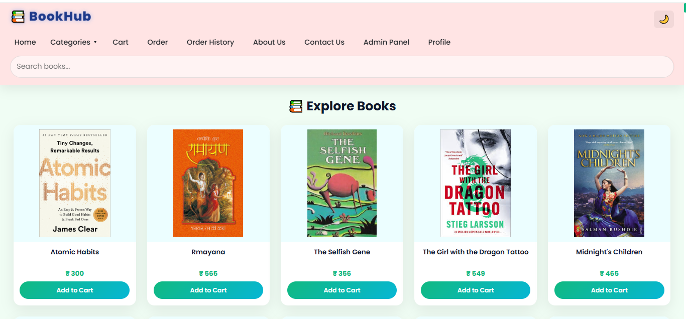
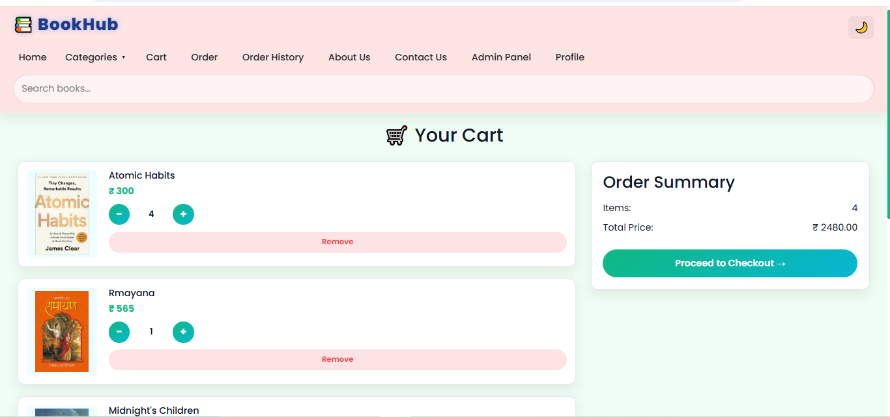
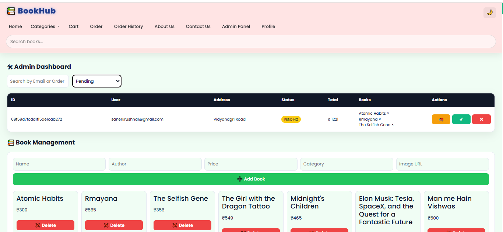
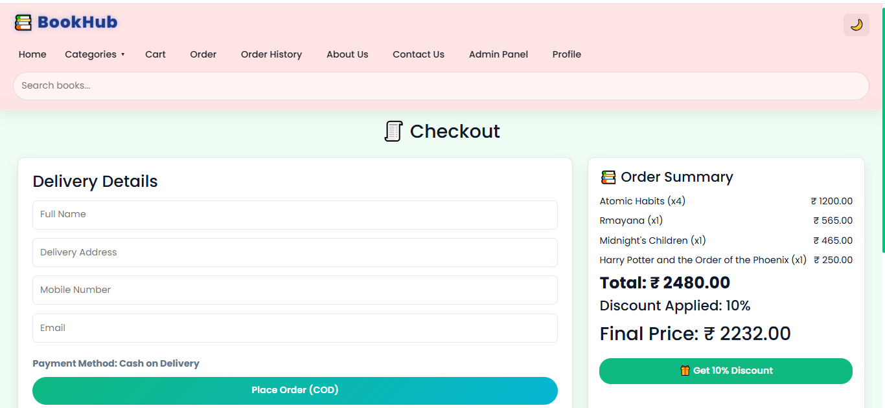
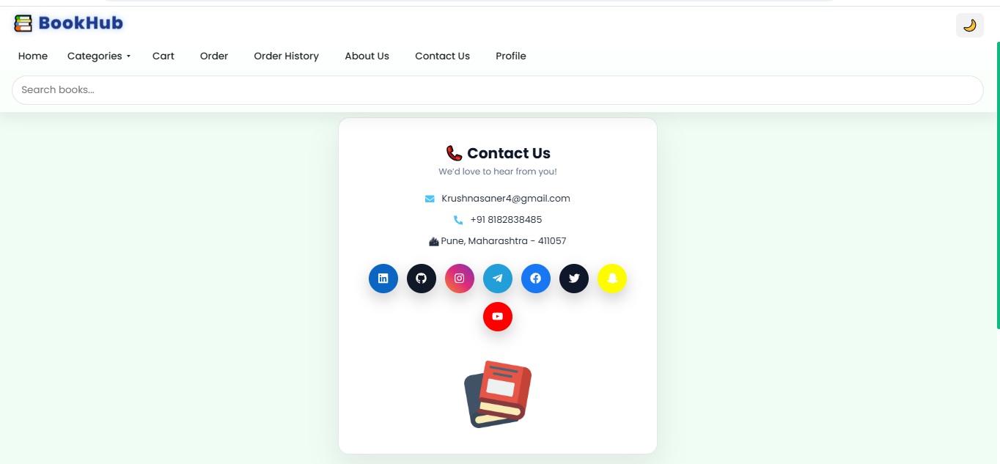
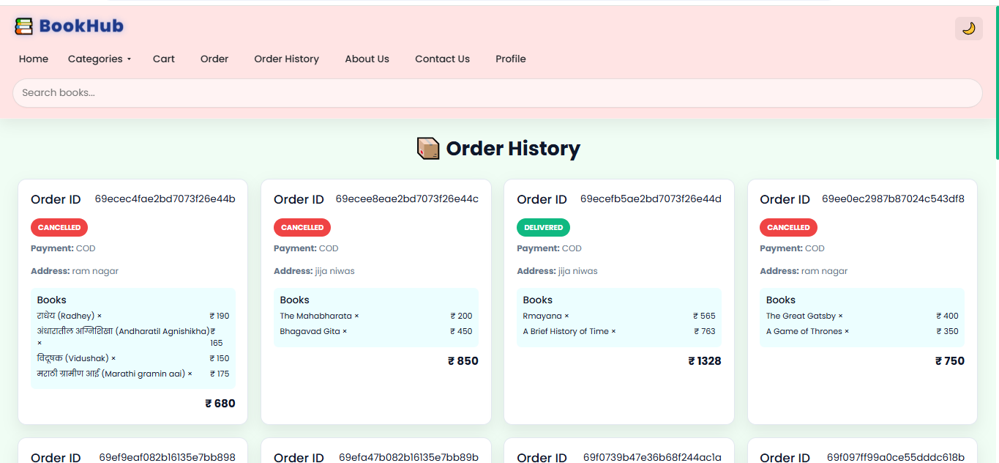
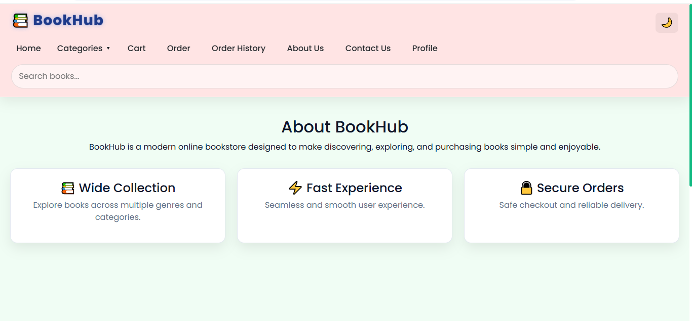
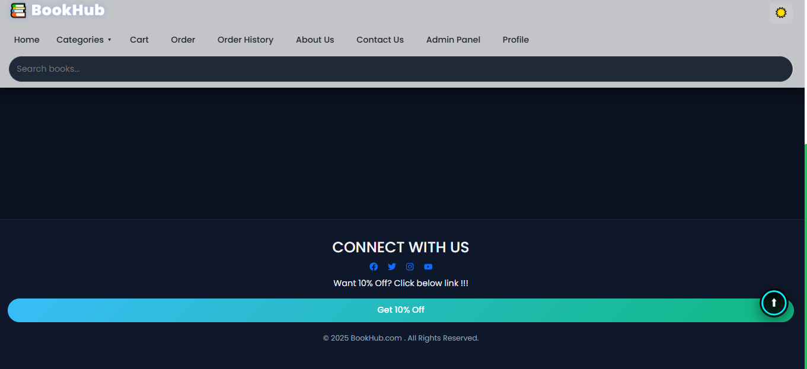
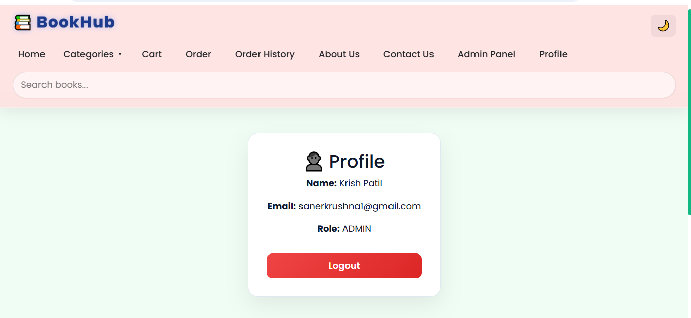

# 📚 BookHub – Full Stack Bookstore Application

BookHub is a modern full-stack **online bookstore web application** built using  
**React.js (Frontend)** and **Spring Boot (Backend)** with **MongoDB Atlas** as the database.

It allows users to browse books, search by category, add to cart, and place orders with a smooth UI experience.

---

## 🌐 Live Demo

🔗 My Website : https://book-hub-snowy.vercel.app  

---

## ⚙️ Tech Stack

### 🖥️ Frontend
- React.js
- React Router DOM
- Axios
- Bootstrap
- CSS Modules

### 🧠 Backend
- Java
- Spring Boot
- Spring Web
- Spring Data MongoDB
- REST API

### 🗄️ Database
- MongoDB Atlas

---

## ✨ Features

### 👤 User Features
- Browse books by category
- Search books by name
- View book details
- Add to cart
- Place orders
- Responsive UI (Mobile + Desktop)
- Dark and Light mode

### 🛠️ Admin Features
- Manage book inventory
- View all orders
- Update order status
- Dashboard view (admin panel)
- Add new books
- Delete existing books

---

## 🧭 Application Modules

- 🔐 Authentication (Login / Signup)
- 📚 Book Listing
- 🔍 Search & Filter
- 🛒 Cart System
- 📦 Order Management
- 🛠️ Admin Dashboard
- 📚 Add and Delete Books 

---

## 📸 Screenshots

### 🏠 Home Page

### 🛒 Cart Page

### 🛠️ Admin Panel

### 📚 Book Orders Page

### 📞 Contact Us Page

### 📩 Order History Page

### 👨‍🎓 About Us Page

### 📩 Footer

### 🧑 Profile Page

---

## 🏗️ Project Architecture

Frontend (React)  →  REST API (Spring Boot)  →  MongoDB Atlas

---

## 🚀 Deployment

- Frontend deployed on **Vercel**
- Backend deployed on **Render**
- Database on **MongoDB Atlas**

---

## 📂 Folder Structure

BookHub/
│
├── bookhub-frontend (React App)
├── bookhub-backend (Spring Boot API)

---

## 💡 Future Improvements

- JWT Authentication (planned upgrade)
- Payment Gateway Integration
- Wishlist Feature
- Email Notifications

---

## 👨‍💻 Developer

**Krushna Saner**  
GitHub: https://github.com/krushna-saner  
LinkdIn : https://www.linkedin.com/in/krushna-saner-214351227 

---

## ⭐ If you like this project

Give a ⭐ to the repository and feel free to fork it!